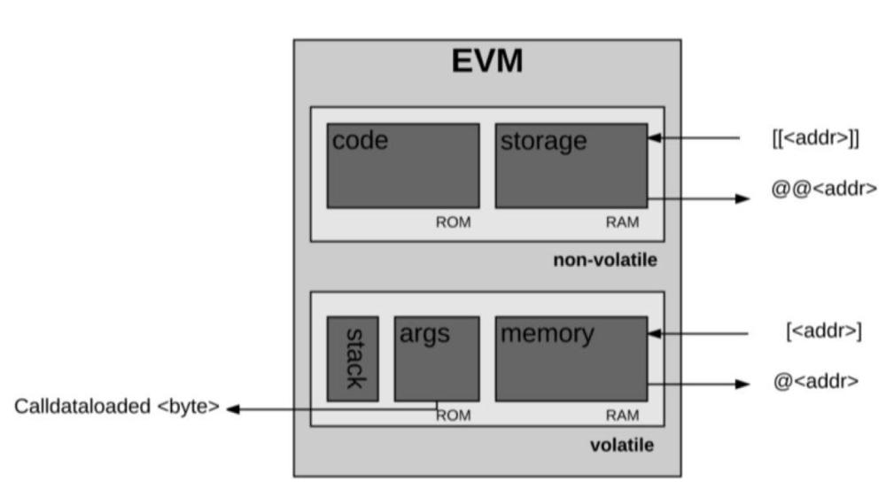
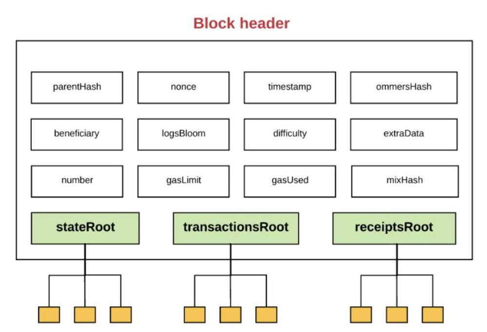
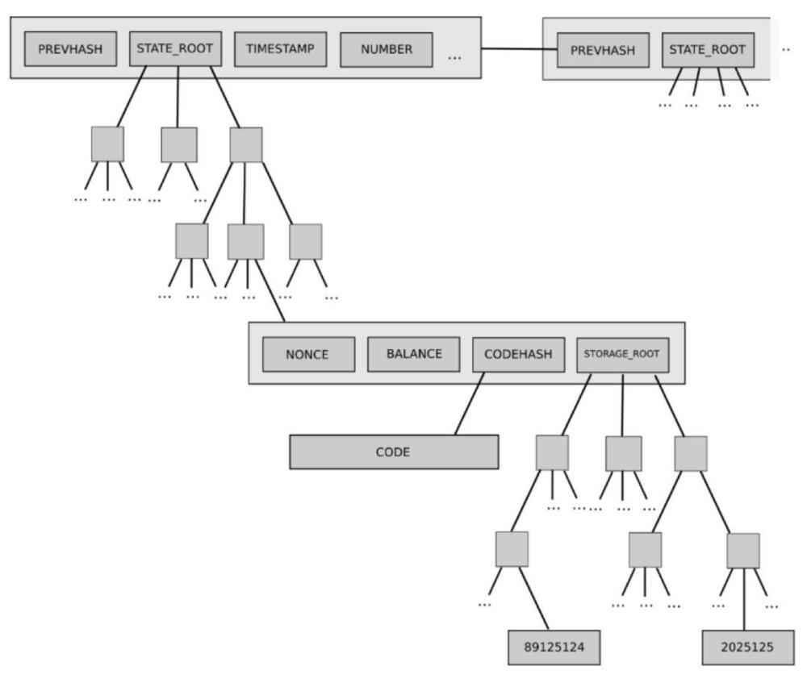

# Learning block chain

## Theory

### Block chain

#### 常见的共识算法

共识算法的评判标准

- 去中心化
- 网络成本
- 扩展性
- 交易确认的速度
- 强大的安全机制和容错能力

常见的共识算法包括:

- 工作量证明（PoW）
基本概念是提供一个机制，需要努力添加一个块，但最小的努力来验证工作已经完成。在这个共识的解决方案中，有“矿工”。矿工寻找下一个建议的块添加到链中。为了增加这个区块，矿工们面临一个数学问题的挑战。解决这个难题需要大量的资源，包括时间，计算能力和电力。一旦矿工解决了这个难题，他们可以将下一个块添加到链中，为其他参与者提供适当的散列信息，以便轻松验证已完成的工作以及该块的属性。矿工的努力会得到回报，这是消耗资源的动力。
- 股权证明（PoS）
PoS的新增机制是“利息”，即持有一定的PoS币一定时间，当然得开着客户端，将获得一定量的固定“利息”。这部分“利息”是新增的PoS币。只要你持有PoS币并开机，你就能获得一定比例的“利息”。在现实世界中股权证明很普遍，最简单的就是股票。股票是用来记录股权的证明，同时代表着投票权和收益权。股票被创造出来以后，除了增发外，不能增加股权数量，要获得股票只能转让
- 委托权益证明（DPoS）
基于PoS衍生出的更专业的解决方案，类似于董事会的投票机制，选举出n个记账节点，在节点中提案者提交的提案被这些记账节点投票决定谁是正确的。
- 实用拜占庭容错共识（PBFT）
PBFT是一种基于严格数学证明的算法，需要经过三个阶段的信息交互和局部共识来达成最终的一致输出。可以证明，系统中只要有三分之二以上比例的正常节点，就能保证最终一定可以输出一致的共识结果，尽管达成共识的时间不确定。
实用拜占庭容错协议的缺点在于不适用于大规模的节点共识，因为随着节点规模的增大，达成共识需要的时间大大增加，不符合效率需求。许多相关研究人员在探讨改进拜占庭协议，以解决不同应用场景下的效率问题。

#### Ethereum

- what is Casper?
- what is POA?
  - 以太坊的工作证明算法被称为“ Ethash ”（以前称为Dagger-Hashimoto）
  - 以太坊正在从一个PoW共识机制转变为一种被称为“证明权益”的东西。
> 为了让一个区块添加到主链上，一个矿工必须要比其他矿工更快的提供出这个“证明”。通过矿工提供的一个数学机制的“证明”来证实每个区块的过程称之为工作量证明(proof of work)。
- what is hypercubes, 影链 - Plasma的前身
- what is chain fibers?
- What is Swarm? what is whisper?
- use of keccak256/sha3
- why ethereum is ASIC-resistant?
- Ethereum roadmap:
> Vinay Gupta写了一篇博客，“以太坊的开展过程”，描述了以太坊开发的四个预期阶段，并把它们命名为：Frontier（前线）、Homestead（家园）、Metropolis（大都会）和Serenity（宁静）。
- 如果是一个创建合约的交易，完成后合约账户的开始余额有什么用？是用来调用其它合约吗？如果是的话，余额用完后合约就不能再执行这种操作，能否给它充值呢？
> value：从发送者转移到接收者的Wei数量。在合约创建交易中，value作为新建合约账户的开始余额
- 链式执行的中断，这是否是一种错误状态的来源？（例如，期待改变三个结点的状态，在第二个结点中失败，这样结点二和三不会改变，但是结点一的状态会改变？）
> 外部拥有账户所设置的Gas限额必须足够高以执行交易，包括由于该交易而发生的任何子执行，例如合约到合约的消息。如果在交易和消息链中，特定的消息执行耗尽，那么该消息的执行将与执行所触发的任何后续消息一起还原。但是，父执行不需要恢复。
- 如何检查transaction receipt？

#### SWARM

#### EVM

#### About gas

> 发送者花费在gas上的所有资金都被发送到“受益人”地址，这通常是矿工的地址。由于矿工正在花费精力进行计算和确认交易，所以矿工收到gas作为奖励。
> 通常，发送者愿意支付的气价越高，矿工从交易中获得的价值就越高。因此，矿工越可能选择它。通过这种方式，矿工可以自由选择要验证或忽略的交易。为了引导发送者设置gas price，矿工可以选择广告他们将执行交易的最低gas价格。
> 由于增加的存储量会增加所有节点上的以太坊状态数据库的大小，因此存在一个激励机制，可以保持较小的数据存储量。因此，如果一个交易的执行有一步是清除一个存储实体，那么为执行这个操作的费用就会被放弃，并且由于释放存储空间的退款就会被返回给发送者。

交易的gas limit 一定要等于或者大于交易使用的intrinsic gas，intrinsic gas包括：

- 为执行交易预定义21,000Gas的成本
- 与交易一起发送的数据的gas费用（对于每个字节的数据或代码，等于零的gas为4gas，对于每个非零字节的数据或代码为68gas）
- 如果交易是创建合约的交易，则另外增加32,000个Gas

#### Acounts

> 不管账户的类型如何，账户状态由四个部分组成：
> - nonce：如果账户是一个外部拥有账户，nonce代表从此账户地址发送的交易序号。如果账户是一个合约账户，nonce代表此账户创建的合约序号
> - balance： 此地址拥有Wei的数量。1Ether=10^18Wei
> - storageRoot： Merkle Patricia树的根节点Hash值（我们后面在解释Merkle tree）。Merkle tree会将此账户存储内容的Hash值进行编码，默认是空值
> - codeHash：此账户EVM（以太坊虚拟机，后面细说）代码的hash值。对于合约账户，就是被Hash的代码并作为codeHash保存。对于外部拥有账户，codeHash域是一个空字符串的Hash值

##### Ethereum中的块是如何组织在一起的？

所有的交易都被分组为“区块”。区块链包含一系列链接在一起的这样的块。在以太坊，一个区块包括：

- 区块头
- 关于包含在此区块中交易集的信息
- 与当前块的ommers相关的一系列其他区块头

区块头是一个区块的一部分，包含了：

- parentHash：父区块头的Hash值（这也是使得区块变成区块链的原因）
- ommerHash：当前区块ommers列表的Hash值
- beneficiary：接收挖此区块费用的账户地址
- stateRoot：状态树根节点的Hash值（回忆一下我们之前所说的保存在头中的状态树以及它使得轻客户端认证任何关于状态的事情都变得非常简单）
- transactionsRoot：包含此区块所列的所有交易的树的根节点Hash值
- receiptsRoot：包含此区块所列的所有交易收据的树的根节点Hash值
- logsBloom：由日志信息组成的一个Bloom过滤器 （数据结构）
- difficulty： 此区块的难度级别
- number：当前区块的计数（创世纪块的区块序号为0，对于每个后续区块，区块序号都增加1）
- gasLimit：每个区块的当前gas limit
- gasUsed： 此区块中交易所用的总gas量
- timestamp：此区块成立时的unix的时间戳
- extraData：与此区块相关的附加数据
- mixHash：一个Hash值，当与nonce组合时，证明此区块已经执行了足够的计算
- nonce：一个Hash值，当与mixHash组合时，证明此区块已经执行了足够的计算

区块链由一堆节点维护。一般来说，有两种类型的节点：全节点和轻节点。
全节点通过下载整条链来进行同步，从创世纪块到当前块，执行包含在其中的所有交易。通常情况下，矿工存储全节点，因为他们在挖矿过程中需要全节点。也可以在不执行每个交易的情况下下载全节点。无论如何，一个全节点都包含整个链。

轻型节点不是下载并存储完整链并执行所有交易，而是仅从起始块到当前块的头，而不执行任何交易或检索任何关联的状态。由于轻节点可以访问块的头，而头中包含了3个tries的Hash，所有轻节点依然可以很容易生成和接收关于交易、事件、余额等可验证的答案。

##### 什么是Ommer?

按照我的理解，Ommer是一串孤立的块，虽然它也解决了上一个块的难题，但是却没有进入主链。为了奖励矿工，对这样的块也进行记录并且给予一定的奖励。

> 一个ommer是一个块，其父区块等于当前块的父区块的父区块。我们来快速浏览一下什么是ommers，以及为什么一个块包含了ommers的块头。
由于以太坊的建立方式，阻塞时间比其他区块链（比如比特币（~10分钟））要低得多（～15秒）。这使得交易处理更快。然而，较短的封锁时间的缺点之一是矿工发现了更多的竞争性块解决方案。这些竞争区块也被称为“孤立区块”（即开采区块不会成为主链）。
ommers的目的是帮助奖励矿工包括这些孤区块。矿工包含的ommers必须是有效的，也就是ommers必须在父区块的第6个子区块之内或更小范围内。在第6个子区块之后，陈旧的孤区块将不会再被引用（因为包含老旧的交易会使事情变得复杂一点）。
Ommer区块会收到比全区块少一点的奖励。不管怎样，依然存在激励来让矿工们纳入孤区块并能从中获得一些报酬。

##### Merkle tries的结构

在Merkle tries中有效地存储所有信息的能力在以太坊我们称之为“轻客户端”或“轻节点”。
其中每个块都包括了三个（状态树、交易树、收据树）Merkel trie结构的根结点的Hash，子树的结构是这样的：

因为Merkle tree中的hash向上传播 - 如果恶意用户试图将假交易交换到Merkle tree的底部，这种更改将导致上面节点的散列发生变化，这将改变以上的节点的散列，等等，直到它最终改变树的根。

使用Merkle Patricia树的好处是，这个结构的根节点在密码上依赖于存储在树中的数据，所以根节点的散列可以用作这个数据的安全身份。由于块头包含状态，交易和收据树的根hash，所以任何节点都可以验证以太坊状态的一小部分，而不需要存储整个状态，这个状态的大小可能是无限的。

## Implementation

### Code exercise

- [Truffle box][21]: provides online code template
- [Not so smart contracts][22]: Github project, bad code examples
- [Solidity patterns][23]: Github projects, design patterns of Solidity
- [Solidity official document][24]
- [Zeppelin Library][25]

### Q & A

- difference between accounts and node?
- difference between transfer() and send()
- what variables are used memory/storage
- how to use function type? difference with functions?
- function call can use x.f(), x is its first argument.
- call(), delegatecall(), staticcall(), why will I use this way to call a function instead of x.f()?
- how to deploy multiple contracts seperately in the same source file?
- how to explain following quote?
> Write your functions in a way that, for example, calls to external functions happen after any changes to state variables in your contract so your contract is not vulnerable to a reentrancy exploit.
- re-enttry issue? should we move from state variable to a local memory variable?
- If A transfer to B, then how could B consume >2300 gas to get the call stuck?
- 当某个交易正处在挖矿过程中时状态不能确定，矿工可以在交易挖矿过程中控制执行时间
- 如何判断无符号数的正负? 现在的代码中，是通过A-B>A来判断B的正负。为什么不能直接把B转换成符号数然后判断？
